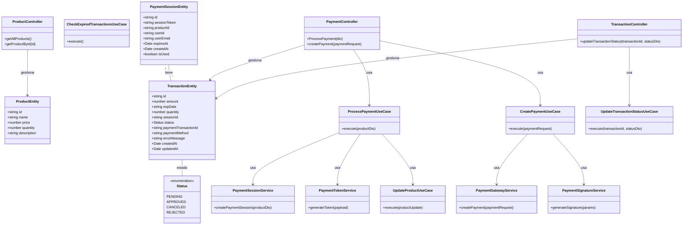

# Diagrama de Clases del Sistema de Pagos

## Descripción del Diagrama de Clases

### Entidades

1. **ProductEntity**: Representa los productos disponibles en el sistema.
   - Atributos: id, name, price, quantity, description

2. **PaymentSessionEntity**: Representa una sesión de pago iniciada por un usuario.
   - Atributos: id, sessionToken, productId, userId, userEmail, expiresAt, createdAt, isUsed

3. **TransactionEntity**: Representa una transacción de pago.
   - Atributos: id, amount, expDate, quantity, sessionId, status, paymentTransactionId, paymentMethod, errorMessage, createdAt, updatedAt
   - Relación: Cada transacción está asociada a una sesión de pago

### Enumeraciones

- **Status**: Define los posibles estados de una transacción (PENDING, APPROVED, CANCELED, REJECTED).

### Servicios del Dominio

1. **PaymentSessionService**: Gestiona la creación de sesiones de pago.
2. **PaymentTokenService**: Genera tokens de seguridad para las transacciones.
3. **PaymentSignatureService**: Genera firmas digitales para verificar la integridad de las solicitudes de pago.

### Servicios de Infraestructura

- **PaymentGatewayService**: Interactúa con la pasarela de pagos externa (Wompi).

### Casos de Uso

1. **ProcessPaymentUseCase**: Inicia el proceso de pago, verificando el stock y creando la sesión y transacción.
2. **CreatePaymentUseCase**: Crea una solicitud de pago en la pasarela externa.
3. **UpdateTransactionStatusUseCase**: Actualiza el estado de una transacción.
4. **UpdateProductUseCase**: Actualiza el stock de un producto.
5. **CheckExpiredTransactionsUseCase**: Verifica y actualiza transacciones expiradas.

### Controladores

1. **PaymentController**: Maneja las solicitudes relacionadas con pagos.
2. **ProductController**: Maneja las solicitudes relacionadas con productos.
3. **TransactionController**: Maneja las solicitudes relacionadas con transacciones.