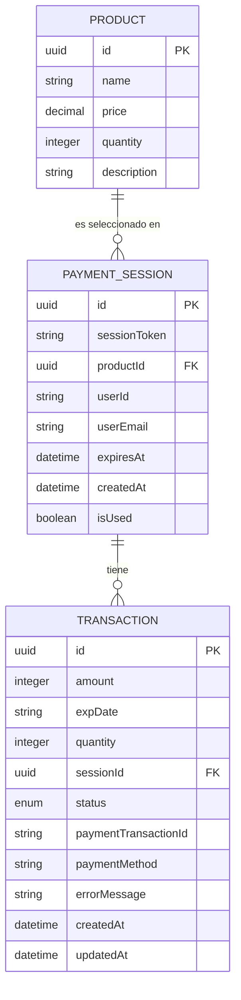

# Diagrama Entidad-Relación del Sistema de Pagos

## Descripción del Diagrama Entidad-Relación

### Entidades y Atributos

1. **PRODUCT**
   - **id**: Identificador único del producto (UUID, clave primaria)
   - **name**: Nombre del producto
   - **price**: Precio del producto (decimal)
   - **quantity**: Cantidad disponible en inventario
   - **description**: Descripción del producto

2. **PAYMENT_SESSION**
   - **id**: Identificador único de la sesión de pago (UUID, clave primaria)
   - **sessionToken**: Token único que identifica la sesión
   - **productId**: Referencia al producto seleccionado (clave foránea)
   - **userId**: Identificador del usuario (opcional)
   - **userEmail**: Correo electrónico del usuario
   - **expiresAt**: Fecha y hora de expiración de la sesión
   - **createdAt**: Fecha y hora de creación de la sesión
   - **isUsed**: Indica si la sesión ya ha sido utilizada

3. **TRANSACTION**
   - **id**: Identificador único de la transacción (UUID, clave primaria)
   - **amount**: Monto de la transacción en centavos
   - **expDate**: Fecha de expiración de la transacción
   - **quantity**: Cantidad de productos en la transacción
   - **sessionId**: Referencia a la sesión de pago (clave foránea)
   - **status**: Estado de la transacción (PENDING, APPROVED, CANCELED, REJECTED)
   - **paymentTransactionId**: Identificador de la transacción en la pasarela de pagos
   - **paymentMethod**: Método de pago utilizado
   - **errorMessage**: Mensaje de error en caso de fallo
   - **createdAt**: Fecha y hora de creación de la transacción
   - **updatedAt**: Fecha y hora de la última actualización

### Relaciones

1. **PRODUCT a PAYMENT_SESSION**: Un producto puede estar asociado a múltiples sesiones de pago (relación uno a muchos). Cada sesión de pago está asociada a un único producto.

2. **PAYMENT_SESSION a TRANSACTION**: Una sesión de pago puede tener múltiples transacciones asociadas (relación uno a muchos). Cada transacción está asociada a una única sesión de pago.

### Flujo de Datos

1. Se crea un registro en la tabla PRODUCT cuando se agrega un nuevo producto al sistema.

2. Cuando un usuario inicia un proceso de pago, se crea un registro en la tabla PAYMENT_SESSION con referencia al producto seleccionado.

3. Al procesar el pago, se crea un registro en la tabla TRANSACTION con referencia a la sesión de pago correspondiente.

4. El estado de la transacción (status) se actualiza según el resultado del proceso de pago.

5. Cuando una transacción se completa (ya sea con éxito o fallo), se actualiza el campo isUsed de la sesión de pago correspondiente.

6. Si una transacción es cancelada o rechazada, se restaura la cantidad del producto en la tabla PRODUCT.