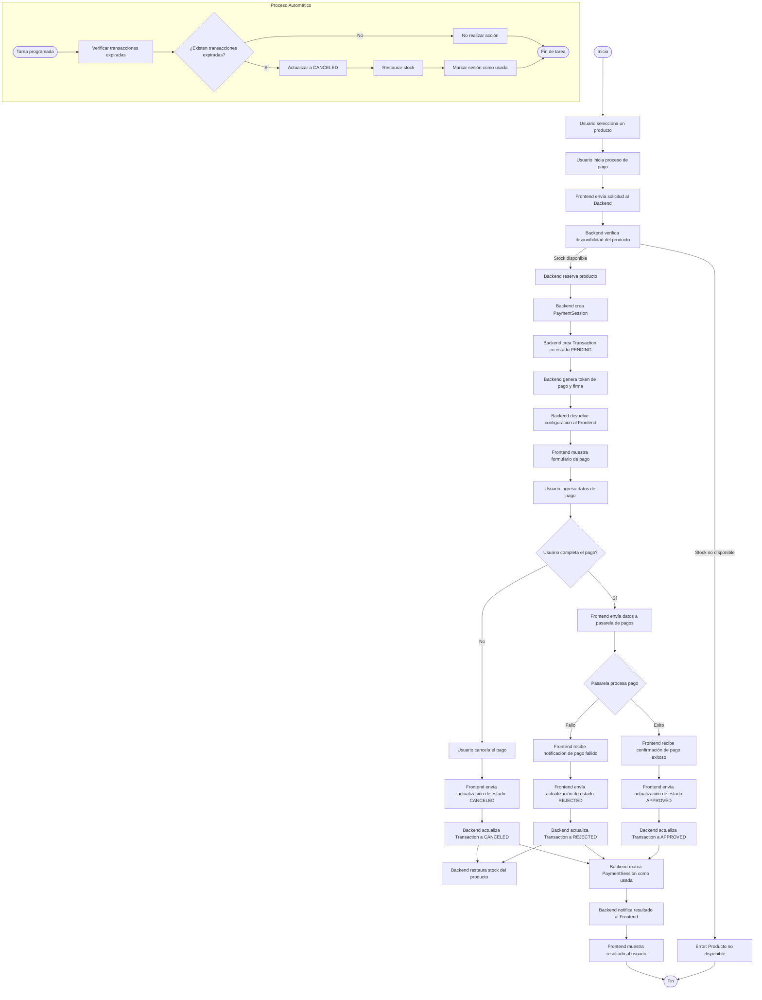

# Diagrama de Flujo Completo del Sistema de Pagos

## Descripción Detallada del Flujo de Pago

### 1. Inicio del Proceso

1. **Selección de Producto**: El usuario navega por la tienda y selecciona un producto para comprar.
2. **Inicio de Pago**: El usuario inicia el proceso de pago proporcionando su correo electrónico.
3. **Solicitud al Backend**: El frontend envía una solicitud al backend con la información del producto seleccionado y los datos del usuario.

### 2. Verificación y Creación de Sesión

4. **Verificación de Stock**: El backend verifica si hay suficiente stock disponible del producto solicitado.
5. **Reserva de Producto**: Si hay stock disponible, el backend reserva temporalmente la cantidad solicitada (reduce el stock).
6. **Creación de Sesión**: El backend crea una sesión de pago (PaymentSession) con un token único y una fecha de expiración.

### 3. Creación de Transacción

7. **Creación de Transacción**: El backend crea una transacción (Transaction) en estado PENDING asociada a la sesión.
8. **Generación de Token**: El backend genera un token de pago, una firma de integridad y la configuración necesaria para la pasarela de pago.
9. **Respuesta al Frontend**: El backend devuelve esta información al frontend.

### 4. Interacción con Usuario

10. **Formulario de Pago**: El frontend muestra un formulario de pago al usuario con los detalles de la transacción.
11. **Ingreso de Datos**: El usuario ingresa los datos de pago requeridos (tarjeta de crédito, etc.).

### 5. Procesamiento de Pago

12. **Decisión del Usuario**: El usuario decide completar o cancelar el pago.
13. **Envío a Pasarela**: Si el usuario completa el formulario, el frontend envía los datos a la pasarela de pagos (Wompi).
14. **Procesamiento**: La pasarela de pagos procesa la transacción y devuelve un resultado (éxito o fallo).

### 6. Actualización de Estado

15. **Notificación de Resultado**: El frontend recibe la notificación del resultado del pago.
16. **Actualización de Estado**: El frontend envía una solicitud al backend para actualizar el estado de la transacción según el resultado:
    - APPROVED: Si el pago fue exitoso
    - REJECTED: Si el pago falló
    - CANCELED: Si el usuario canceló el proceso

### 7. Backend Procesa Resultado

17. **Actualización de Transacción**: El backend actualiza el estado de la transacción en la base de datos.
18. **Restauración de Stock**: Si el estado es REJECTED o CANCELED, el backend restaura el stock del producto.
19. **Marcado de Sesión**: El backend marca la sesión de pago como usada.

### 8. Finalización

20. **Notificación al Frontend**: El backend notifica el resultado final al frontend.
21. **Visualización al Usuario**: El frontend muestra el resultado del proceso de pago al usuario.

### 9. Proceso Automático de Expiración

- **Tarea Programada**: Una tarea programada se ejecuta periódicamente para verificar transacciones expiradas.
- **Verificación**: La tarea busca transacciones en estado PENDING cuya fecha de expiración ha pasado.
- **Actualización**: Las transacciones expiradas se actualizan a estado CANCELED.
- **Restauración**: Se restaura el stock de los productos asociados a las transacciones expiradas.
- **Marcado**: Se marcan las sesiones de pago asociadas como usadas.