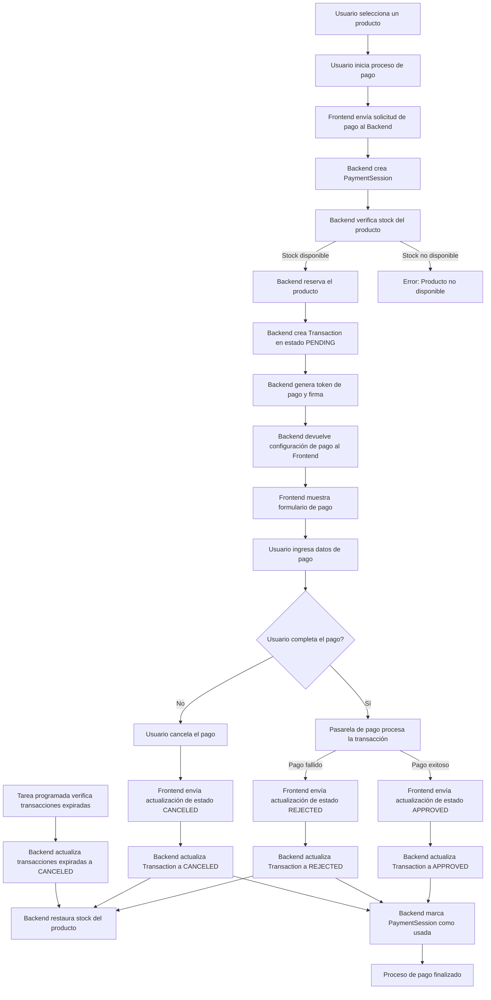

# Diagrama de Flujo del Proceso de Pago

## Descripción del Flujo de Pago

### Inicio del Proceso
1. El usuario selecciona un producto en la tienda.
2. El usuario inicia el proceso de pago, proporcionando su correo electrónico.
3. El frontend envía una solicitud al backend con el ID del producto, la cantidad y el correo del usuario.

### Creación de la Sesión y Transacción
4. El backend verifica la disponibilidad del producto.
5. Si hay stock disponible, el backend reserva la cantidad solicitada (reduce el stock).
6. El backend crea una sesión de pago (PaymentSession) con un token único y una fecha de expiración.
7. El backend crea una transacción (Transaction) en estado PENDING asociada a la sesión.
8. El backend genera un token de pago, una firma de integridad y la configuración necesaria para la pasarela de pago.
9. El backend devuelve esta información al frontend.

### Proceso de Pago
10. El frontend muestra el formulario de pago al usuario.
11. El usuario ingresa sus datos de pago o decide cancelar.
12. Si el usuario completa el pago, la pasarela procesa la transacción.
13. Dependiendo del resultado, el frontend envía una actualización de estado al backend:
    - APPROVED: Si el pago fue exitoso
    - REJECTED: Si el pago fue rechazado
    - CANCELED: Si el usuario canceló el proceso

### Finalización del Proceso
14. El backend actualiza el estado de la transacción según corresponda.
15. Si el estado es REJECTED o CANCELED, el backend restaura el stock del producto.
16. El backend marca la sesión de pago como usada.
17. El proceso de pago finaliza.

### Proceso Automático de Expiración
- Una tarea programada verifica periódicamente las transacciones pendientes con sesiones expiradas.
- Las transacciones expiradas se actualizan a estado CANCELED y se restaura el stock de los productos.

## Estados de la Transacción

- **PENDING**: La transacción ha sido creada pero el pago aún no se ha completado.
- **APPROVED**: El pago se ha completado exitosamente.
- **REJECTED**: El pago ha sido rechazado por la pasarela de pago.
- **CANCELED**: El usuario ha cancelado el proceso de pago o la sesión ha expirado.