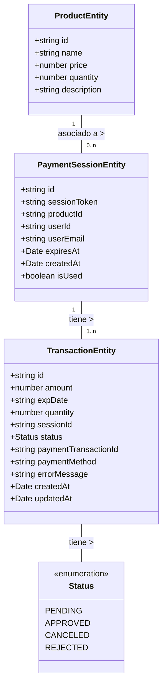

# Diagrama Relacional del Sistema de Pagos

## Descripción de las Entidades

### ProductEntity
Representa los productos disponibles en el sistema. Cada producto tiene un identificador único, nombre, precio, cantidad disponible en inventario y una descripción.

### PaymentSessionEntity
Representa una sesión de pago iniciada por un usuario. Contiene información sobre el producto seleccionado, el usuario que realiza la compra, un token de sesión único y fechas de expiración y creación. El campo `isUsed` indica si la sesión ya ha sido utilizada para completar una transacción.

### TransactionEntity
Representa una transacción de pago. Está asociada a una sesión de pago y contiene información sobre el monto, la cantidad de productos, el estado de la transacción y detalles adicionales como el método de pago utilizado o mensajes de error en caso de fallo.

### Status
Enumeración que define los posibles estados de una transacción: PENDING (pendiente), APPROVED (aprobada), CANCELED (cancelada) o REJECTED (rechazada).